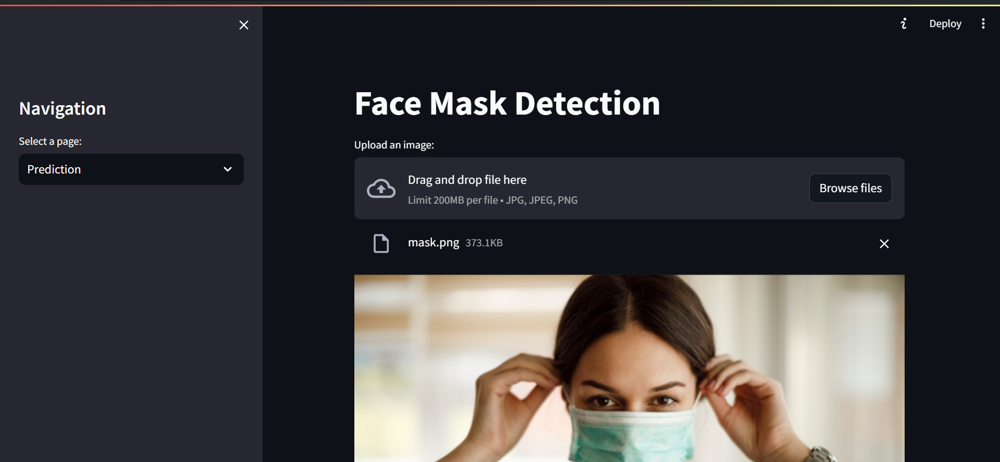
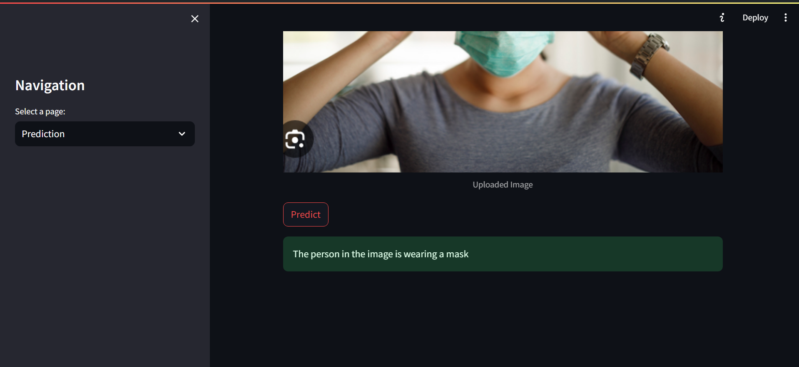
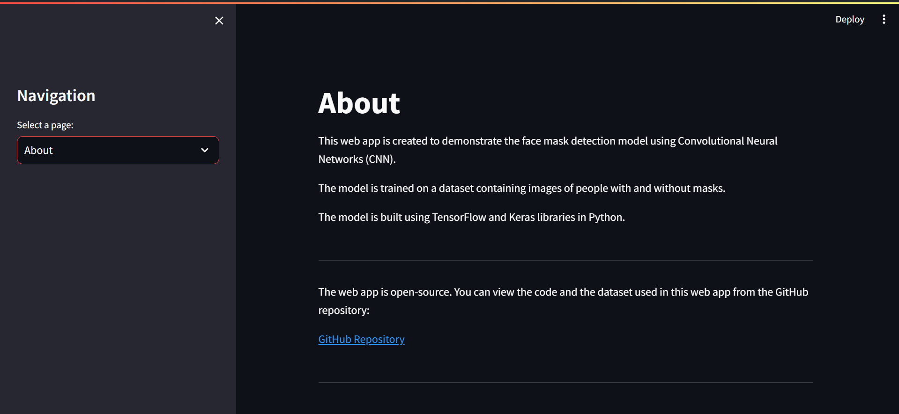

# Face Mask Detection using CNN

This web app is created to demonstrate the face mask detection model using Convolutional Neural Networks (CNN).
The model is trained on a dataset containing images of people with and without masks.
The model is built using TensorFlow and Keras libraries in Python.

